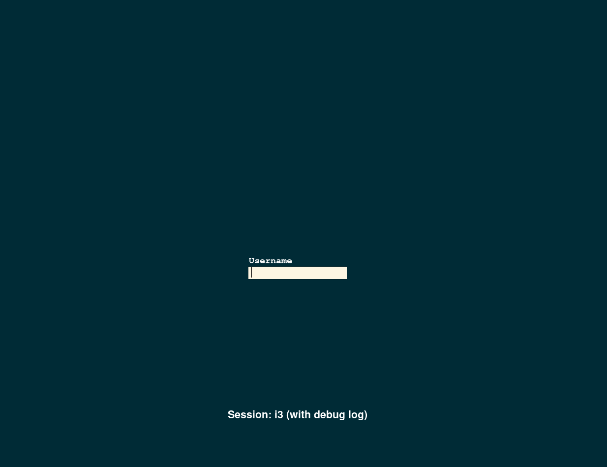

# slim-theme-solarized-dark-blue

 

How to install:

~~~
cd /usr/share/slim/themes/
git clone https://github.com/Izet-Kali/slim-theme-solarized-dark-blue
~~~

edit file `/etc/slim.conf`

change `current_theme       default` to `current_theme       slim-theme-solarized-dark-blue`
